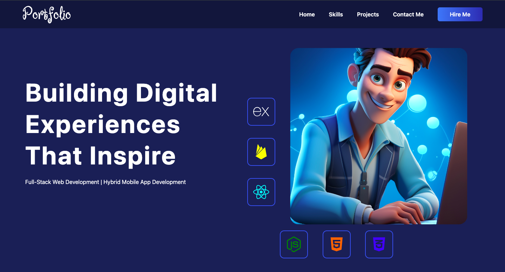

# React + Vite

This template provides a minimal setup to get React working in Vite with HMR and some ESLint rules.

Currently, two official plugins are available:

- [@vitejs/plugin-react](https://github.com/vitejs/vite-plugin-react/blob/main/packages/plugin-react/README.md) uses [Babel](https://babeljs.io/) for Fast Refresh
- [@vitejs/plugin-react-swc](https://github.com/vitejs/vite-plugin-react-swc) uses [SWC](https://swc.rs/) for Fast Refresh
# portfolio-website-react-vite
# Portfolio Site

Welcome to my portfolio site! This project showcases my skills, projects, and ways to contact me.

## Table of Contents
- [Technologies Used](#technologies-used)
- [Features](#features)
- [Installation](#installation)
- [Usage](#usage)
- [Contributing](#contributing)
- [License](#license)

## Pages
- [Home](Home.md)
- [Skills](Skills.md)
- [Projects](Projects.md)
- [Contact Me](ContactMe.md)

## Technologies Used
- **Frontend**: React.js, Vite
- **Email Service**: EmailJS

## Features
- Responsive design
- Showcase of skills and projects
- Contact form

## Installation
To run this project locally, follow these steps:
1. Clone the repository
2. Navigate to the project directory
3. Install the dependencies
4. Run the development server
5. Edit src/data/json files to manage details

## Usage
Explore the different sections of the portfolio.

## Contributing
If you'd like to contribute to this project, feel free to fork the repository and submit a pull request.

## License
This project is licensed under the MIT License.
